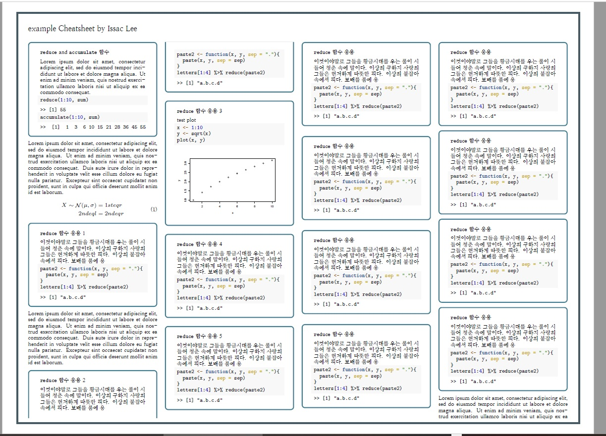

# Cheatsheet Generator by [Statistics playbook](https://www.youtube.com/c/statisticsplaybook) 

[슬기로운 통계생활](https://www.youtube.com/c/statisticsplaybook) 컨닝페이퍼 생성기


To use it, include the following in the YAML header of your Rmarkdown file. (문서 설정부분은 다음과 같이 해주시면 됩니다.)

```yaml
---
output:
  bookdown::pdf_document2:
    latex_engine: xelatex
    toc: false
    template: "setting.tex"
mainfont: NanumMyeongjo
packagename: example
editor: Issac Lee
# colsep: true
ncol: 4
boxbg: white
themecol: cyan
---
```

## Tips and Result

* Use `\bcolorbox` and `\ecolorbox` indicating the begin and end of the box.

* For example, the following body in the Rmd will generates the first box below

* For plotting use the option out.width="100%"

````markdown
\bcolorbox

# **`reduce` and `accumulate` 함수**

Lorem ipsum dolor sit amet, consectetur adipiscing elit, sed do eiusmod tempor incididunt ut labore et dolore magna aliqua. Ut enim ad minim veniam, quis nostrud exercitation ullamco laboris nisi ut aliquip ex ea commodo consequat. Duis aute irure dolor in reprehenderit in voluptate velit esse cillum dolore eu fugiat nulla pariatur. Excepteur sint occaecat cupidatat non proident, sunt in culpa qui officia deserunt mollit anim id est laborum.

```{r}
reduce(1:10, sum)
accumulate(1:10, sum)
```
\ecolorbox

````


